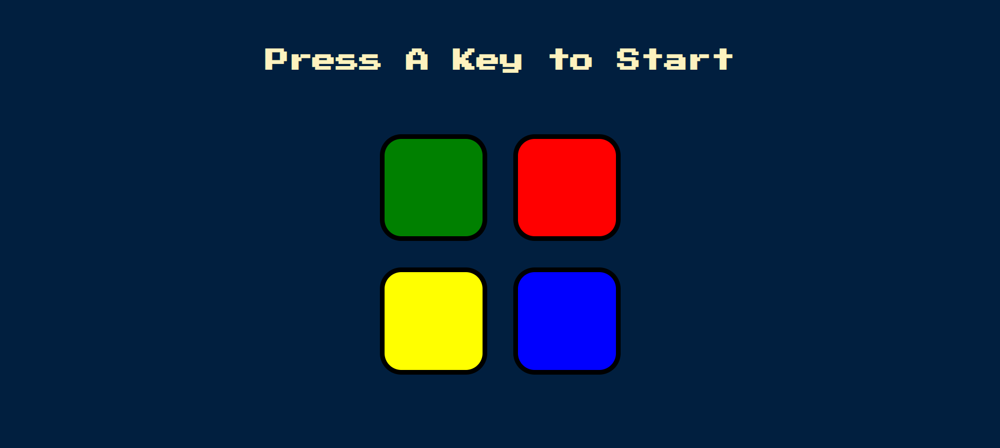
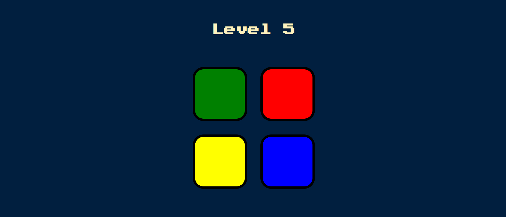

# 🎮 Simon Game  

A browser-based memory game inspired by the classic **Simon Says**, developed using **HTML, CSS, JavaScript, and jQuery**. The game challenges players to repeat an ever-growing sequence of colors and sounds, testing memory and focus. Features include sequence generation, smooth animations, sound feedback, input validation, and restart functionality. This project demonstrates strong use of **DOM manipulation, event handling, and game logic implementation**.  

---

## 📌 Features  
- Four interactive color buttons with corresponding sound effects.  
- Randomly generated sequences that grow in difficulty each level.  
- Smooth animations and feedback for correct/incorrect moves.  
- Restart functionality when the player makes a mistake.  

---

## 🛠️ Tech Stack  
- **HTML** – structure and layout  
- **CSS** – styling and animations  
- **JavaScript (ES6)** – game logic and DOM manipulation  
- **jQuery** – event handling and UI interactions  

---

## 🚀 How to Play  
1. Press any key to start the game.  
2. Watch the sequence of flashing colors and sounds.  
3. Repeat the sequence by clicking the buttons in the correct order.  
4. Each level adds a new color to the sequence.  
5. Game ends if the wrong button is pressed.  

---

## 🎯 Demo  
🔗 [Live Demo](https://srikarpittala.github.io/Simon-Game/)  

---

## 📷 Preview  

### 🟢 Start Screen  
  

### 🔢 Level Progression  
  

### ❌ Game Over  
  

---

## 💡 Future Enhancements  
- Add difficulty levels (Easy, Medium, Hard).  
- Implement a high-score system with local storage.  
- Add background music and advanced sound effects.  
- Make it mobile-responsive for better gameplay on phones.  

---

